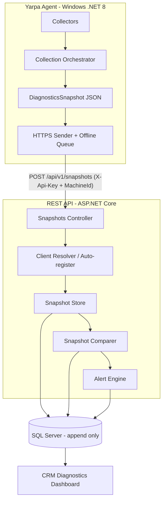
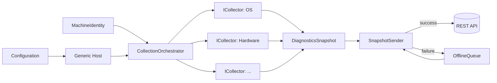
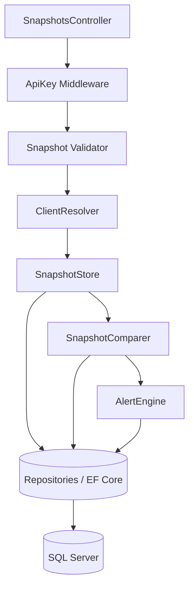

# ארכיטקטורה – Yarpa Support Agent

מסמך זה מתאר את הארכיטקטורה הכוללת, השכבות, זרימת הנתונים והחלטות התכנון המרכזיות.

## סקירה כללית

המערכת מורכבת מארבעה חלקים עם הפרדת אחריות ברורה:



עקרון מנחה: **ה-Agent טיפש, השרת חכם.** ה-Agent רק אוסף ושולח. כל הלוגיקה
(זיהוי, אחסון, השוואה, התראות) נמצאת בשרת.

## 1. שכבת ה-Agent

אפליקציית Console ב-.NET 8. בנויה סביב Generic Host (`Microsoft.Extensions.Hosting`)
לצורך DI, configuration ו-logging.

### רכיבים

- **Configuration** – קריאת `appsettings.json` + CLI args + משתני סביבה. כולל
  `ApiBaseUrl`, `ApiKey`, timeouts, retry policy.
- **MachineIdentity** – חישוב `MachineId` יציב (MachineGuid → fallback ל-BIOS Serial + MAC).
- **Collectors** – אוסף רכיבי `ICollector`, כל אחד אחראי על section אחד. ראה
  [collectors.md](collectors.md).
- **CollectionOrchestrator** – מריץ את כל ה-Collectors (חלקם במקביל), אוסף תוצאות,
  מבודד כשלים, ובונה `DiagnosticsSnapshot`.
- **SnapshotSender** – מסריאל ל-JSON ושולח ב-HTTPS דרך `HttpClientFactory` + Polly
  (retry עם exponential backoff).
- **OfflineQueue** – אם השליחה נכשלת, שומר את ה-JSON בתיקייה מקומית ומנסה שוב
  בהרצה הבאה. מבטיח שלא יאבד Snapshot.

### תרשים רכיבי ה-Agent



### ממשק Collector

```csharp
public interface ICollector
{
    string SectionName { get; }
    Task<CollectorResult> CollectAsync(CancellationToken ct);
}
```

כל Collector מוסיף/מוסר דרך רישום DI בלבד, ללא שינוי ב-Orchestrator. זהו ה-plug-in
model שמאפשר הרחבה עתידית ללא שינוי ארכיטקטורה.

## 2. שכבת ה-REST API

ASP.NET Core (.NET 8), ארכיטקטורה שכבתית:



### רכיבי השרת

- **ApiKey Middleware** – מאמת `X-Api-Key`, מזהה את הלקוח (Customer). דוחה 401 אם לא תקין.
- **Snapshot Validator** – ולידציה של מבנה ה-JSON הנכנס (FluentValidation).
- **ClientResolver** – מאתר את ה-Machine לפי `MachineId` תחת ה-Customer; אם לא קיים, מבצע auto-register.
- **SnapshotStore** – שומר Snapshot חדש (append-only) כולל ה-JSON הגולמי + עמודות מפוענחות.
- **SnapshotComparer** – משווה ל-Snapshot הקודם של אותו Machine ומייצר רשומות `Change`.
- **AlertEngine** – מפעיל חוקים על ה-Snapshot וה-Changes ומייצר `Alert`.

## 3. שכבת מסד הנתונים

SQL Server, גישת **append-only** – כל שליחה יוצרת Snapshot חדש; אין דריסה.
טבלאות עיקריות: `Customers`, `Machines`, `Snapshots`, `SnapshotSections`, `Changes`, `Alerts`.
פירוט מלא ב-[data-model-and-api.md](data-model-and-api.md).

## 4. שכבת ה-CRM Dashboard

מוצג בתוך ה-CRM הקיים של Yarpa. מסכים: Summary, Timeline, Alerts.
מאופיין ב-[specification.md](specification.md). לא נבנה בשלב הנוכחי.

## החלטות תכנון ורציונל

- **Contracts משותפים (`Yarpa.Contracts`)** – ה-DTOs של המודל חיים בפרויקט אחד המשותף
  ל-Agent ול-API, כדי למנוע drift בין הצדדים. זהו מקור האמת של סכמת ה-JSON.
- **Client identification היברידי** – API Key מזהה את הלקוח (חברה); `MachineId` מזהה
  את המחשב. משלב אבטחה (scoping per customer) עם אפס-קונפיגורציה למחשב בודד (auto-register).
- **Idempotency לפי `snapshotId`** – מונע כפילויות במקרה של retry לאחר שליחה שהצליחה
  אך התשובה אבדה.
- **בידוד כשלים ברמת Collector** – כשל ברכיב אחד לא מפיל את האיסוף; ה-section מסומן
  `error` וההודעה נשמרת. איש התמיכה רואה מה נאסף ומה נכשל.
- **כל הלוגיקה בשרת** – מאפשר לשנות חוקי השוואה/התראות ללא צורך בעדכון ה-Agent אצל הלקוחות.

## תרחישי הרצה של ה-Agent

- ידני (הרצת exe).
- CLI (עם flags).
- מתוך תוכנת Yarpa (הפעלת התהליך).
- Windows Service (עתידי).

כל התרחישים מריצים את אותו pipeline: Collect → Build model → Send.

## דרישות לא-פונקציונליות (תמצית)

- זמן איסוף מלא: יעד עד ~30 שניות במחשב טיפוסי.
- ה-Agent חייב לפעול ללא הרשאות אדמין ככל הניתן; לסמן `partial` היכן שנדרש admin.
- טיפול מלא בשגיאות, ללא crash. פירוט ב-[specification.md](specification.md).
