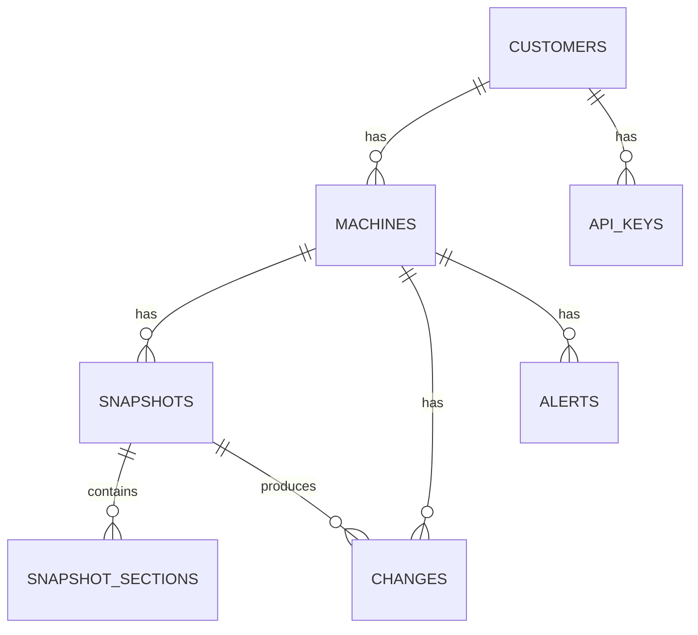

# מודל נתונים, REST API וסכמת DB

מסמך זה מגדיר את חוזה ה-JSON בין ה-Agent לשרת, את ה-REST API, ואת סכמת מסד הנתונים.
מקור האמת של ה-DTOs הוא פרויקט `Yarpa.Contracts`.

## 1. מודל ה-JSON – DiagnosticsSnapshot

המודל הוא אובייקט אחד עם metadata + מפת sections. כל section מכיל `status` והנתונים
עצמם, כך שאיסוף חלקי עדיין תקף.

```json
{
  "snapshotId": "5f3d1e2a-8c4b-4a9d-9f1e-2b7c6d5a4e3f",
  "schemaVersion": "1.0",
  "agentVersion": "1.0.0",
  "machineId": "a1b2c3d4e5f6...",
  "collectedAtUtc": "2026-07-06T14:03:22Z",
  "sections": {
    "system": {
      "status": "ok",
      "data": {
        "computerName": "POS-01",
        "userName": "cashier",
        "domainOrWorkgroup": "WORKGROUP",
        "uptimeSeconds": 84213
      }
    },
    "os": {
      "status": "ok",
      "data": {
        "caption": "Windows 11 Pro",
        "version": "10.0.22631",
        "build": "22631",
        "edition": "Pro",
        "architecture": "64-bit",
        "language": "he-IL"
      }
    },
    "hardware": {
      "status": "ok",
      "data": {
        "manufacturer": "Dell Inc.",
        "model": "OptiPlex 7090",
        "serialNumber": "ABC1234",
        "bios": { "manufacturer": "Dell", "version": "1.12.0", "releaseDate": "2024-03-01" },
        "cpu": { "name": "Intel Core i5-11500", "cores": 6, "logical": 12 },
        "ramTotalMb": 16384,
        "ramModules": 2
      }
    },
    "disks": {
      "status": "ok",
      "data": [
        { "drive": "C:", "sizeGb": 476.9, "freeGb": 210.3, "freePercent": 44.1, "mediaType": "SSD" }
      ]
    },
    "network": {
      "status": "ok",
      "data": [
        {
          "name": "Ethernet",
          "mac": "00:1A:2B:3C:4D:5E",
          "ipv4": "192.168.1.20",
          "gateway": "192.168.1.1",
          "dns": ["192.168.1.1", "8.8.8.8"]
        }
      ],
      "externalIp": "203.0.113.10"
    },
    "printers": {
      "status": "ok",
      "data": [
        { "name": "EPSON TM-T20", "isDefault": true, "status": "Idle", "portName": "USB001", "driver": "EPSON TM-T20" }
      ]
    },
    "usbDevices": {
      "status": "ok",
      "data": [
        { "name": "USB Serial Device", "vid": "11CA", "pid": "0300", "deviceClass": "Ports", "manufacturer": "Verifone" }
      ]
    },
    "comPorts": {
      "status": "ok",
      "data": [
        { "port": "COM3", "deviceName": "USB Serial Device (COM3)" }
      ]
    },
    "paymentTerminals": {
      "status": "ok",
      "data": [
        { "vendor": "Verifone", "model": "VX520", "comPort": "COM3", "vid": "11CA", "pid": "0300" }
      ]
    },
    "services": {
      "status": "ok",
      "data": [
        { "name": "MSSQLSERVER", "displayName": "SQL Server", "state": "Running", "startMode": "Auto" }
      ]
    },
    "sqlServer": {
      "status": "ok",
      "data": {
        "installed": true,
        "instances": [
          { "name": "MSSQLSERVER", "version": "15.0.2000", "serviceState": "Running" }
        ]
      }
    },
    "installedSoftware": {
      "status": "ok",
      "data": [
        { "name": "Yarpa ERP", "version": "8.4.2", "publisher": "Yarpa", "installDate": "2025-11-02" }
      ]
    },
    "eventLogs": {
      "status": "ok",
      "data": [
        { "log": "System", "source": "Service Control Manager", "eventId": 7031, "level": "Error", "timeUtc": "2026-07-05T09:12:00Z", "message": "..." }
      ]
    },
    "yarpaVersion": {
      "status": "ok",
      "data": { "product": "Yarpa ERP", "version": "8.4.2", "detectedBy": "registry" }
    }
  }
}
```

### כללי חוזה

- `snapshotId`, `machineId`, `schemaVersion`, `collectedAtUtc` – חובה.
- כל section הוא `{ "status": "ok|partial|error", "data": ..., "error": "..." }`.
- section שנכשל: `status = "error"`, `data = null`, `error` עם ההודעה.
- שינוי לא-תואם-לאחור בסכמה מעלה את `schemaVersion` (major).
- כל השדות ב-DTOs עם `[JsonPropertyName]` מפורש (camelCase) כדי לנעול את החוזה.

## 2. REST API

Base path: `/api/v1`. אימות: header `X-Api-Key`. תעבורה: HTTPS בלבד. גוף: JSON.

### 2.1 קליטת Snapshot (עיקרי – משמש את ה-Agent)

```
POST /api/v1/snapshots
Headers: X-Api-Key: <customer key>
Body:    DiagnosticsSnapshot (JSON)
```

תגובות:
- `202 Accepted` – נקלט (חדש). גוף: `{ "snapshotId": "...", "machineId": "...", "changes": <n>, "alerts": <n> }`.
- `200 OK` – התקבל אך זהה ל-`snapshotId` קיים (idempotent, לא נשמר שוב).
- `400 Bad Request` – JSON לא תקין / חסרים שדות חובה.
- `401 Unauthorized` – API Key לא תקין.
- `413 Payload Too Large` – חריגה מגודל מרבי.

### 2.2 Endpoints לקריאה (עבור ה-CRM Dashboard)

```
GET /api/v1/machines?customerId=&search=      # רשימת מחשבים של לקוח
GET /api/v1/machines/{machineId}/summary      # תמונת מצב עדכנית (Snapshot אחרון מפוענח)
GET /api/v1/machines/{machineId}/snapshots    # רשימת snapshots (paged)
GET /api/v1/snapshots/{snapshotId}            # Snapshot מלא (JSON גולמי)
GET /api/v1/machines/{machineId}/changes      # Timeline של שינויים (paged)
GET /api/v1/machines/{machineId}/alerts?state=open
```

כל ה-endpoints לקריאה מחזירים 401 ללא הרשאה מתאימה, ו-404 אם המזהה לא קיים.

## 3. סכמת מסד הנתונים (SQL Server, append-only)



### טבלאות

**Customers**
- `CustomerId` (PK, int/guid)
- `Name`
- `CreatedAtUtc`

**ApiKeys**
- `ApiKeyId` (PK)
- `CustomerId` (FK)
- `KeyHash` (hash של המפתח, לא בטקסט גלוי)
- `IsActive`, `CreatedAtUtc`, `RevokedAtUtc`

**Machines**
- `MachineId` (PK – ה-fingerprint מה-Agent, string)
- `CustomerId` (FK)
- `ComputerName`, `FirstSeenUtc`, `LastSeenUtc`
- `LastSnapshotId` (FK, nullable)

**Snapshots** (append-only)
- `SnapshotId` (PK – GUID מה-Agent)
- `MachineId` (FK)
- `CollectedAtUtc`, `ReceivedAtUtc`
- `AgentVersion`, `SchemaVersion`
- `RawJson` (nvarchar(max) – המודל המלא כפי שהתקבל)
- עמודות מפוענחות לשאילתות מהירות: `OsCaption`, `OsBuild`, `YarpaVersion`,
  `SqlInstalled`, `MinFreeDiskPercent`, `RamTotalMb` וכו'.
- אינדקס על (`MachineId`, `CollectedAtUtc`).

**SnapshotSections** (אופציונלי – אם רוצים שאילתות פר-section)
- `SnapshotSectionId` (PK)
- `SnapshotId` (FK)
- `SectionName`, `Status`, `DataJson`, `Error`

**Changes**
- `ChangeId` (PK)
- `MachineId` (FK), `SnapshotId` (FK – ה-snapshot שיצר את השינוי)
- `ChangeType` (DeviceAdded / DeviceRemoved / ComPortChanged / OsChanged / ...)
- `SectionName`, `OldValue`, `NewValue`
- `DetectedAtUtc`

**Alerts**
- `AlertId` (PK)
- `MachineId` (FK)
- `AlertType` (ServiceDown / DiskAlmostFull / PaymentTerminalMissing / ...)
- `Severity` (info / warning / critical)
- `Message` (עברית)
- `State` (open / resolved)
- `CreatedAtUtc`, `ResolvedAtUtc`
- `SourceSnapshotId` (FK), `SourceChangeId` (FK, nullable)

### עקרונות DB

- **Append-only**: `Snapshots` לא מתעדכן ולא נמחק. `Machines.LastSnapshotId` מצביע על האחרון.
- **Idempotency**: `SnapshotId` הוא PK; שליחה כפולה נדחית ברמת ה-DB / נבדקת מראש.
- **Retention**: מדיניות שמירת snapshots ישנים תיקבע בהמשך (אין דריסה, אך ניתן לארכב).
